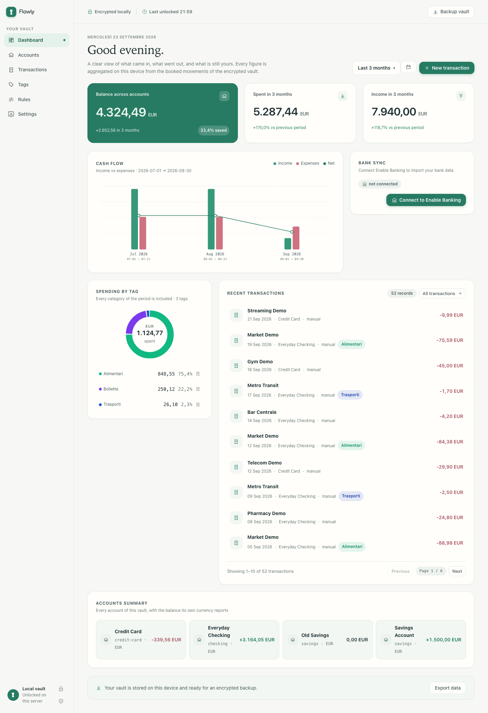
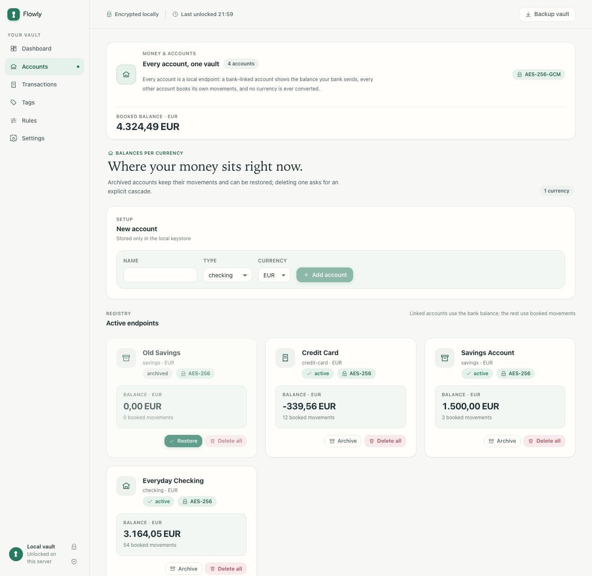
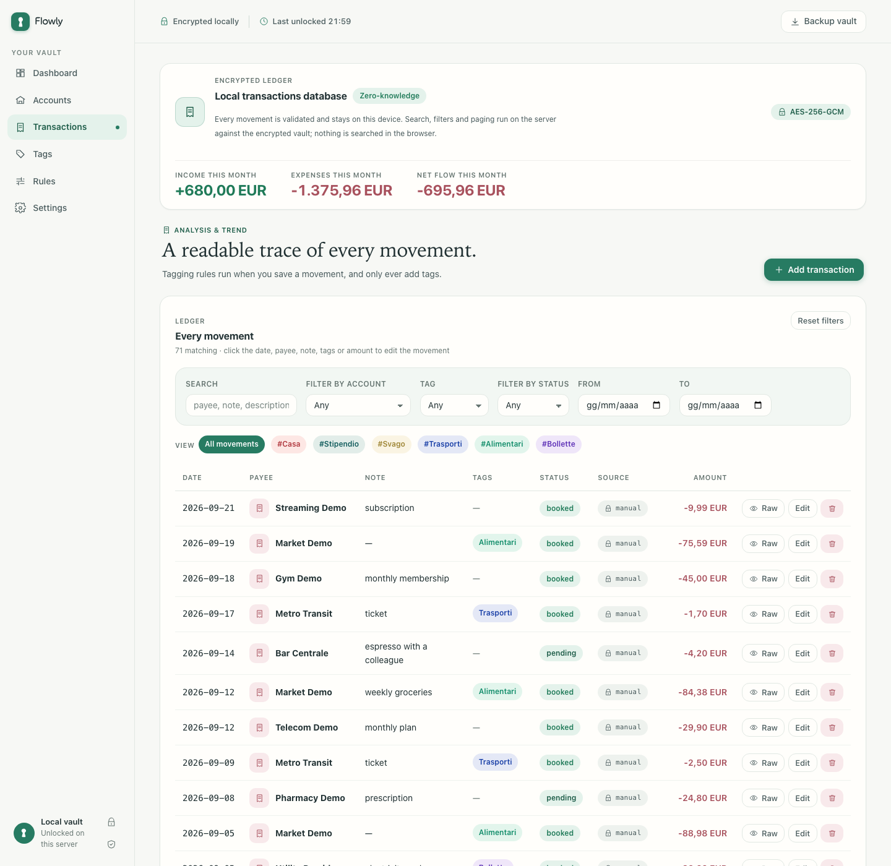
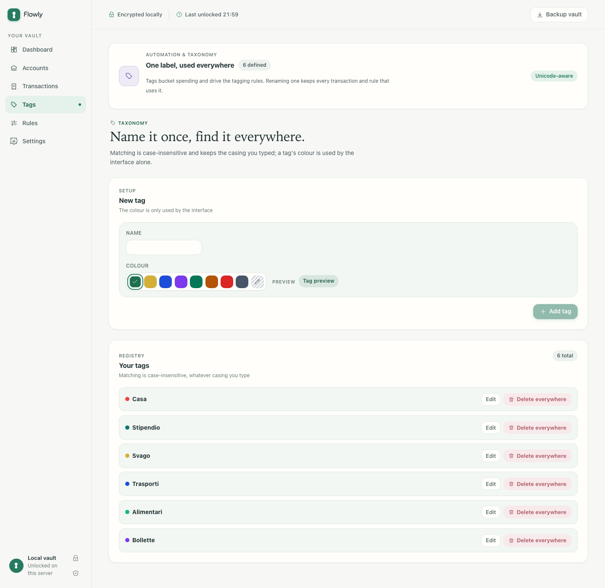
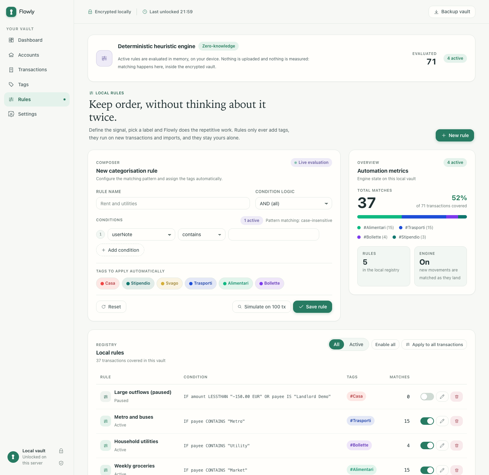
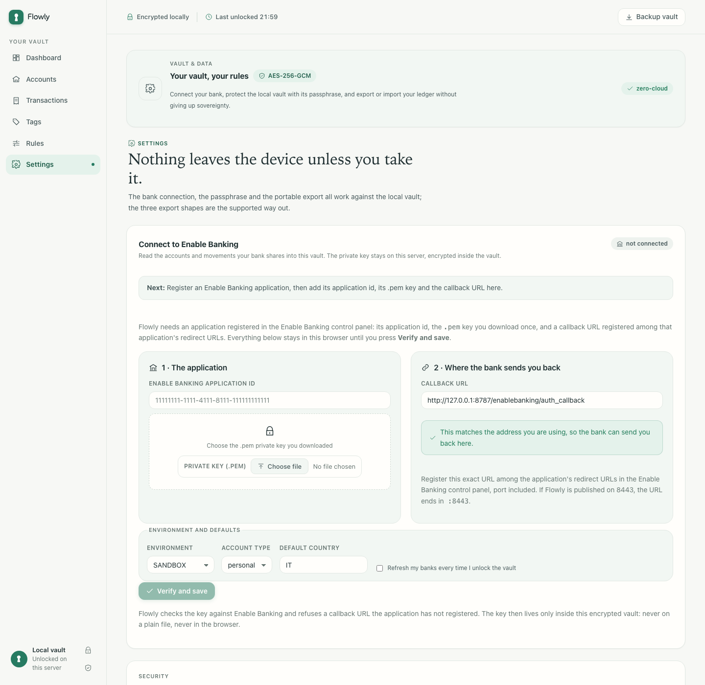

<div align="center">


# Flowly

**Self-hosted personal finance. Your money, your device, your keys.**

No account · No cloud · No tracking.

[](LICENSE)

[](https://github.com/ivanvaccarics/flowly/actions/workflows/image.yml)


</div>

---

Flowly is finance software you run yourself: one **encrypted vault** on hardware
you control, opened from the browser over your private network. You keep the
passphrase, the server keeps the ciphertext, and nothing leaves your machine.
While the vault is locked there is nothing readable on disk — not in the
database, not in journals, not in caches, not in logs.

| Most finance apps | Flowly |
| --- | --- |
| Sign up with email and password | No registration, no identity |
| Your data on their servers | Your data on infrastructure you control |
| Silent background sync | You decide what moves, and when |
| Telemetry and ads pay the bills | Zero telemetry, zero trackers, zero ads |
| Useless without the Internet | Needs only your private network |
| They hold the keys | Your passphrase unlocks your key |

## What it looks like

Six sections, one design language, and every figure read from the vault. No
placeholder data anywhere in the app.

**Dashboard** — balances per currency, monthly cash flow and spending by tag, for
the months you pick.



**Accounts** — one card per account with its real balance and booked-movement
count; archived accounts stay visible and can be restored.



**Transactions** — the ledger: server-side filters, tag pills, the month's
income, expenses and net, and rows that open for editing with one click.



**Tags** — the taxonomy rules and filters work with, colour-coded and renamed in
place.



**Rules** — the rule composer with live evaluation beside the engine's own
coverage, per rule and per tag.



**Settings** — the bank connection, the passphrase and the three export shapes,
all against the local vault.



> The screenshots come from a throwaway vault full of invented data:
> `pnpm demo:seed` fills it and `pnpm demo:screenshots` captures the six
> sections — see
> [docs/RUNNING.md](docs/RUNNING.md#regenerating-the-readme-screenshots).

## Features

- **Accounts** — checking, savings, credit cards, cash, wallets and investments,
  each in its own currency, with archived accounts you can restore.
- **Transactions** — payee, dates, status, tags and your own notes, kept
  separate from imported bank descriptions so nothing you write is overwritten,
  with server-side filters and paging over the whole ledger.
- **Tags** — Unicode-aware and case-insensitive, keeping the casing you typed,
  colour-coded and renameable in place. Tags added by hand and by a rule share
  one set, and a rule never removes a tag you chose.
- **Rules** — AND/OR conditions over note, payee, description, amount or account,
  with decimal amounts in their own currency (never a count of cents), a live
  preview of what a draft would match, and a coverage count per rule and tag.
  Rules only add tags, and deleting one never takes a tag away.
- **Multi-currency, honestly** — amounts are integers in minor units and every
  transaction keeps its original currency, so no total ever blends unlike
  currencies without a real exchange rate.
- **Dashboard** — every figure follows the months you select; cash flow is
  charted month by month and spending is a donut per currency, and both answer
  the pointer and the keyboard.
- **Search** — server-side filters over date range, account, tag, amount,
  currency, status and source, plus free text across payee, description and
  notes.
- **Bank connection (Enable Banking)** — connect with your own application id and
  private key, kept only inside the encrypted vault; link each shared account,
  import its activity, reconcile pending rows in place, and keep your notes and
  tags. The vault stays the canonical ledger.
- **Portable data** — a transaction CSV, a plain ZIP with one CSV per table plus
  a manifest, and a password-encrypted complete archive, with protection against
  spreadsheet formula injection and imports that are previewed and atomic.
- **Privacy** — no registration, no telemetry, no ad SDKs, no automatic upload
  and one-tap local data deletion.

## Security

- A **mandatory passphrase** protects a randomly generated key, derived with
  Argon2id and a per-vault salt.
- **Encrypted at rest** with SQLCipher 4: while the vault is locked there is no
  readable data on disk.
- **Sessions** live in an `HttpOnly` cookie with a CSRF token, expire after an
  idle window and lock the vault when the last one goes away; writes carry the
  revision they read, so two browsers can never overwrite each other silently.
- **Fails closed**: a wrong key or tampered data raises a clear error, never a
  silently empty vault.
- **Before you trust it with your money:** there is no passphrase recovery, plain
  CSV exports are not encrypted, and the server is not a backup. Keep an export
  whose password you know.

## Quick start

Prerequisites: **Node.js 22.12+** and **pnpm** (`corepack enable pnpm`).

```bash
pnpm install            # install the workspace
pnpm contracts:generate # regenerate types from contracts/ (committed output)
pnpm dev                # server on 127.0.0.1:8787 + UI on 127.0.0.1:5173

pnpm verify             # format, lint, secret scan, types and tests
pnpm build              # compile the server and bundle the UI
```

Or self-host the stack with Docker:

```bash
docker compose up --build
```

Images are published for `linux/amd64` and `linux/arm64` as
`ghcr.io/ivanvaccarics/flowly`, so `docker compose pull` never compiles SQLCipher
on your own machine. Compose publishes the port on `127.0.0.1` only, and the
server refuses to bind a public interface unless `FLOWLY_ALLOW_PUBLIC_BIND=true`
is set on purpose.

## Repository layout

```text
apps/server             TypeScript service: domain, application, Fastify API
apps/web                React/Vite browser client
packages/web-contracts  Generated types and validators from the schemas
contracts/              JSON Schemas, fixtures and golden expected results
deployment/self-hosted  Docker Compose for the server vault
spikes/                 Phase 0 feasibility code, kept as evidence
```

## Documentation

- [docs/RUNNING.md](docs/RUNNING.md) — run Flowly locally, self-host it, and
  regenerate the screenshots above.
- [docs/DEPLOYMENT.md](docs/DEPLOYMENT.md) — install on Docker Compose, trust the
  local certificate authority, upgrade, roll back and back up.
- [docs/AUTOMATIC_STARTUP.md](docs/AUTOMATIC_STARTUP.md) — Docker and Tailscale
  on a machine that reboots on its own: the `startup.sh` script and the systemd
  unit that bring the stack back at boot.
- [docs/TESTING.md](docs/TESTING.md) — the acceptance script and the manual test
  plan, with what a pass looks like for every screen.
- [docs/DESIGN.md](docs/DESIGN.md) — the UI design system, its tokens, and the
  brand lockup and palette.
- [docs/PLAN.md](docs/PLAN.md) — architecture, security requirements, data model
  and the phase-by-phase delivery plan.
- [docs/adr/](docs/adr/) — the decisions behind storage, key hierarchy, sessions,
  portability, concurrency and cascades.
- [docs/security/](docs/security/) — threat model, privacy notice, data-loss
  warning, support matrix, verification status and the security audit.
- [contracts/README.md](contracts/README.md) — the canonical schemas, fixtures
  and golden vectors.
- [docs/TERMS_OF_SERVICE.md](docs/TERMS_OF_SERVICE.md) and
  [docs/PRIVACY_POLICY.md](docs/PRIVACY_POLICY.md) — the terms for running an
  instance and connecting it to a bank, and what Flowly stores and who is
  responsible for what.

## Status

Flowly is in **early development**. The encrypted vault, the finance flows, the
dashboard, server-side search, the Enable Banking connector and the deployment
hardening all work; an independent cryptographic review and a full
assistive-technology audit are still open. The plan behind them lives in
[docs/PLAN.md](docs/PLAN.md).

## Contributing

Open an issue to share an idea, report a bug or challenge a design decision.
Shared schemas and fixtures, CSV edge cases and design tokens are good first
areas, and accessibility feedback is especially welcome. We follow
[Conventional Commits](https://www.conventionalcommits.org/) and ask one thing
above all: **never commit secrets or real financial data.**

## License

[Apache License 2.0](LICENSE) — use it, fork it, audit it.
